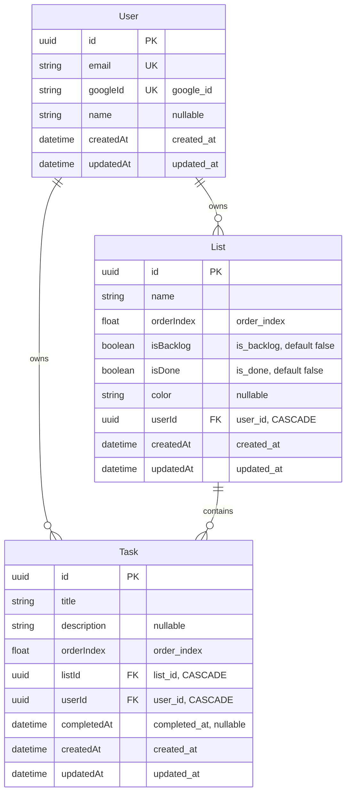

# GSD Database Schema

This document provides a visual representation of the GSD database schema generated from the Prisma schema file.

## Entity Relationship Diagram

## Relationships

- **User → List**: One-to-many (cascade delete)
- **User → Task**: One-to-many (cascade delete)
- **List → Task**: One-to-many (cascade delete)

## Database Indexes

### users table

- `email` - Unique index for fast user lookups

### lists table

- `(userId, orderIndex)` - Composite index for ordered list retrieval
- `(userId, isDone)` - Composite index for filtering Done lists

### tasks table

- `(userId, listId, orderIndex)` - Composite index for ordered task retrieval within lists
- `(userId, completedAt)` - Composite index for filtering completed tasks

## Key Constraints

- All foreign keys use CASCADE delete to maintain referential integrity
- UUIDs used for all primary keys
- Unique constraints on `email` and `googleId` for users
- Timestamps (`createdAt`, `updatedAt`) automatically managed by Prisma

## Source

Generated from: `apps/backend/prisma/schema.prisma`
